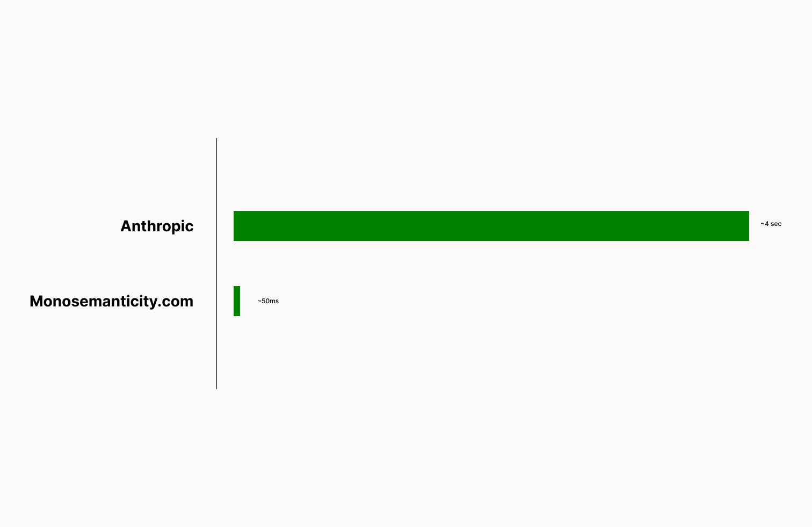

# Monosemantic Search

We take the [visualization interface](https://transformer-circuits.pub/2023/monosemantic-features/vis/a1.html) from [Anthropic's](https://github.com/anthropics) _Towards Monosemanticity: Decomposing Language Models With Dictionary Learning_ and make it **80x+** faster.

Check it out [here](https://www.monosemanticity.com/)!



## How does this work?

We first scrape all of the data from Anthropic. Then index all the tokens we want to search using redis. Redis then allows for extremely fast retrieval.

We then created a backend using python and flask that allows us to retreive data really quickly with the redis indexs.

Finally, all of this is presented with our NextJS frontend.

The biggest optimization here is the redis indexing. Redis allows us to make our search numerous times faster than the current search at Anthropic's visualization page.

The only problem is that sorting all of the data in memory is expensive. The redis DB is about 3.6GB in size.

## Dev & Production

First get all the data. This is done from the scraper folder. It's all already scraped. You can use that data as well.

To scrape all of the data run

```bash
python3 main.py
```

The go we must index all of the data on redis. Make sure you have a redis instance that can handle 4GB of data.

From the server folder:

```bash
pip3 install requirements.txt
```

then

```bash
python3 indexing.py
```

then run the flask server, `app.py`.

Finally, to run the frontend, go to the frontend folder.

```bash
npm install
```

then build the web app

```bash
npm run build
```

finally start it

```bash
npm run start
```

## Acknowledgement

This work was created by [Mustafa Aljadery](https://www.maxaljadery.com/) & [Siddharth Sharma](https://stanford.edu/~sidshr/).
